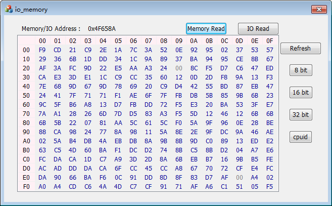

#IO-Memory
A ReadWrite-Everything style test software based on [WinIO](#winio) which can read and write Computer memory and IO, need to enter testing mode under windows 7 or xp when use.
***
<br>
##WinIo
WinIO程序库允许在32位的Windows应用程序中直接对I/O端口和物理内存进行存取操作。通过使用一种内核模式的设备驱动器和其它几种底层编程技巧，它绕过了Windows系统的保护机制

###使用方法(http://www.internals.com/)
* 进入操作系统的测试模式(打开cmd输入"bcdedit /set testsigning on")，之后将WinIo/Binaries下的WinIo32.dll和WinIo64.sys拷贝到应用程序所在同级目录  

* 程序中需要嵌入WinIo/Source/Dll/x86/Debug中的WinIo.lib才可以使用WinIo函数库提供的函数  

* WinIo提供8个功能函数调用：  
  * 初始化WinIo函数库：  
  ```cpp
    bool _stdcall InitializeWinIo();
  ```
  * 在内存中清除WinIo库：  
  ```cpp
    void _stdcall ShutdownWinIo();
  ```
  * 从一个输入或输出IO读取一个字节/字/双字数据：  
  ```cpp
    bool _stdcall GetPortVal(WORD wPortAddr, PDWORD pdwPortVal, BYTE bSize);
  ```
  * 将一个字节/字/双字的数据写入输入或输出IO：
  ```cpp
    bool _stdcall SetPortVal(WORD wPortAddr, DWORD dwPortVal, BYTE bSize);
  ```
  * 将物理内存的一部分映射到一个32位应用程序的线性地址空间：
  ```cpp
    PBYTE _stdcall MapPhysToLin(PBYTE pbPhysAddr, DWORD dwPhysSize, HANDLE *pPhysicalMemoryHandle)
  ```
  * 解除原先使用MapPhysToLin函数映射的一段线性物理内存区域，该区域被映射到应用程序所属的线性地址空间：
  ```cpp
    bool _stdcall UnmapPhysicalMemory(HANDLE PhysicalMemoryHandle, PBYTE pbLinAddr)
  ```
  * 从指定的物理地址读取一个双字数据：
  ```cpp
    bool _stdcall GetPhysLong(PBYTE pbPhysAddr, PDWORD pdwPhysVal);
  ```
  * 将一个双字型数据写入指定的物理地址：
  ```cpp
    bool _stdcall SetPhysLong(PBYTE pbPhysAddr, DWORD dwPhysVal);
  ```

##io_memory
  

仿照RW的界面风格，可以读取4GB以内的内存和64KB的IO地址空间，使用时请注意关闭杀毒软件以防误删除.sys驱动文件，cpuid功能测试可以使用，具体代码还在实现中
